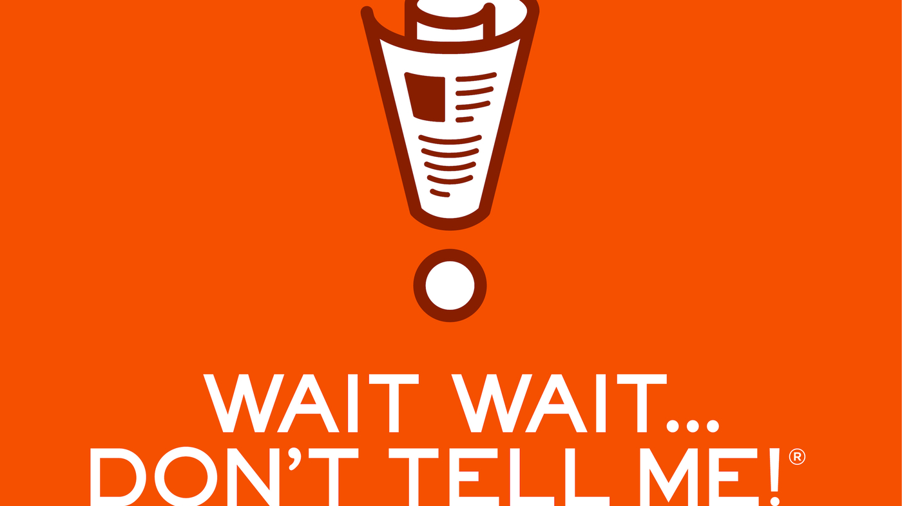

<h1>Wait Wait...Don't Tell Me! App</h1>
<h3>Max T. Smith</h3>

Wait Wait...Don't Tell Me! was one of the first podcasts I ever listened to. It's always been a good source of entertainment while keeping me up-to-date on the latest happenings at the same time. If you're from the Chicago area (or not), I'm sure you've listened at some point. Here is my implementation of an app that simulates the game show with real-time news.

You can find more detailed information <a href=https://docs.google.com/document/d/1bwHtl38FcH62jV6vH7qICVCaZfiKGF8mojT1-8mPv4c/edit?usp=sharing>here</a>.

Please send my way any feedback you have, positive or negative. I am particularly interested in feedback on my prompting. I have no background in prompt engineering, so I would be very grateful if someone who does could give me suggestions for improvement. 

